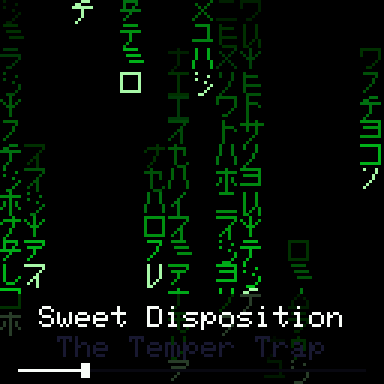
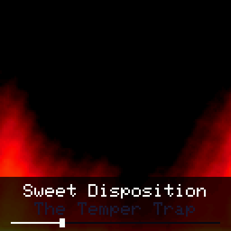
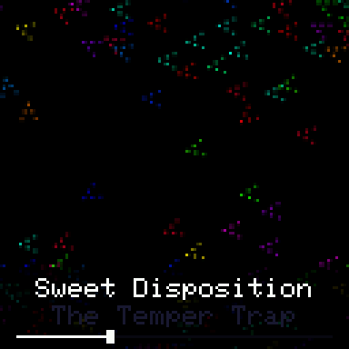
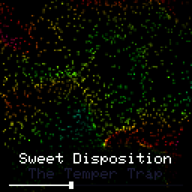
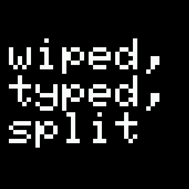
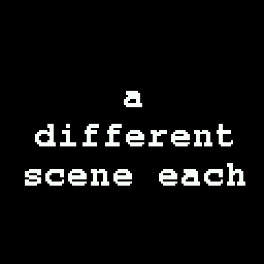

# tqt-lyrics

Time-synced Spotify lyrics and a set of generative visualisers on a LilyGo
T-QT Pro — an ESP32-S3 with a 0.85", 128x128 colour panel.

Two modes, switched with the right-hand button:

- **Lyrics** — one line at a time, in stark white kinetic typography. 18
  animation styles across 5 typefaces, a different pairing every line.
- **Visuals** — 13 colour particle fields, one assigned to each track.

Measured on hardware: lyrics run at ~120 fps, the visualisers at 75–124 fps
depending on the field.

## What it looks like

Captured off the device itself over serial, not mocked up.

| | | |
|---|---|---|
|  |  |  |
| `matrix` | `fire` | `boids` |
|  |  |  |
| `turbulence` | lyrics: `stack` | lyrics: `invert` |
|  |  |  |
| lyrics: `zoom` | lyrics: `rowfade` | lyrics: `flash` |

The lyric shots use the built-in demo text rather than a real song, so the
images do not reproduce anyone's lyrics.

## What you need

- A **LilyGo T-QT Pro** (ESP32-S3FN4R2 — 4 MB flash, 2 MB PSRAM)
- A **Spotify account**. Free works; you only need playback state.
- **2.4 GHz WiFi.** The ESP32 has no 5 GHz radio, and this is the most common
  reason a board silently fails to join.
- Python with [PlatformIO](https://platformio.org/): `pip install platformio`

## Build

```
python -m platformio run -t upload
python -m platformio device monitor
```

It builds and runs without credentials, showing a demo sequence so every
lyric style is visible. Connect Spotify when you want it to follow real music.

## Connecting Spotify

1. Create an app at <https://developer.spotify.com/dashboard>, add
   `http://127.0.0.1:8888/callback` as a Redirect URI, and enable **Web API**.
   Copy the Client ID — the client secret is neither needed nor used.
2. Run `python tools/spotify_auth.py`. It authorises in your browser and offers
   to write the values straight into `src/secrets.h`. Everything happens on
   your machine; nothing is sent anywhere but Spotify.
3. Add your WiFi details to `src/secrets.h` and reflash.

`src/secrets.h` is gitignored. The scopes requested are read-only
(`user-read-currently-playing`, `user-read-playback-state`).

**Auth uses PKCE, so there is no client secret in the firmware.** A device that
only reads playback state has no business carrying a secret that could be
pulled out of its flash by anyone holding the board. The trade is that Spotify
rotates the refresh token on every refresh, so the firmware persists each new
one to NVS — the value in `secrets.h` is only a first-boot seed, and it going
stale is expected. A rejected token is dropped and the seed retried, so the
device recovers on its own.

## Controls

| input | action |
|---|---|
| **right button** (GPIO 47) | switch visuals ⇄ lyrics |
| **left button** (GPIO 0) | lyrics: re-roll the current line's look · visuals: next visualiser |

In lyrics mode the left button shifts the seed, which changes scene *and*
typeface together, so every press is a visible change on the line in front of
you.

Over serial:

| key | action |
|---|---|
| `V` / `L` | set visuals / lyrics mode absolutely |
| `m` | toggle mode |
| `n` | next visualiser (visuals) · re-roll style (lyrics) |
| `A` | back to the per-track visualiser |
| `s` | toggle the status readout |
| `o` | cycle panel rotation, printing the value for `SCREEN_ROTATION` |
| `l` | force a lyrics re-fetch |
| `F` | dump the last frame as hex, to reconstruct off-device |

The panel mounts upside down relative to TFT_eSPI's rotation 0, so
`SCREEN_ROTATION` in `src/main.cpp` defaults to **2**. If yours differs, press
`o` until it looks right and put that number in the define.

## Lyrics mode

At roughly 16 characters per row there is no space for a lyric sheet, so this
does not try to be one. It shows one line at a time and lets the *presentation*
carry it.

Scene and typeface are both drawn from the line index, independently, so they
change together but never in lockstep. Five families rotate — **sans, serif,
mono, oblique** and the built-in **pixel** cell — each a ladder of faces from
24pt down to the 6x8 GLCD cell.

| style | what it does |
|---|---|
| hero | the longest word set enormous, rest of the line small beneath |
| stack | words stacked and left-aligned, each sliding in after the last |
| invert | knocked out of a filled field |
| wipe | type present from frame one; a shutter retreats off it |
| scroll | long lines travel across as one big row, between two rules |
| type | typewriter reveal with a blinking block cursor |
| flash | slams in inverted, then settles |
| rule | heavy bars drive in from both edges, type held between |
| box | a card grows from the centre, type knocked out of it |
| split | line broken in two, halves arriving from opposite sides |
| zoom | grows into place, stepping up the ladder as it lands |
| wipeup | shutter retreating downward instead of across |
| glitch | rows tear sideways, with occasional bigger slips |
| shadow | a dim offset copy behind, closing in as the line lands |
| mirror | the block sits high with a dimmed echo beneath it |
| decode | characters settle out of noise, left to right |
| rowfade | rows arrive one at a time from alternating sides |
| stamp | lands oversized for a beat, then settles onto the fitted size |

**Long lines split into phrases rather than shrinking.** A line that will not
fit at a large face is broken at word boundaries into the fewest phrases that
each fit in at most 3 rows, shown in sequence across the line's own duration.
Two constraints matter and only one is obvious: capping the *height* is not
enough, because at a small face five rows still fit and the line never splits.
Capping rows per phrase is what actually forces big type.

Each phrase gets time in proportion to its length, which tracks the singing
better than dividing evenly. LRC carries per-line timestamps only — there is no
word-level timing in what LRCLIB serves — so within a line this is an
approximation however it is done.

**Nothing is ever clipped.** `layoutFit()` steps down the ladder until the whole
line fits, and `wrapText()` reports overflow rather than silently dropping rows.
The floor is the 6x8 cell at size 1: 21 columns by 16 rows, ~330 characters,
comfortably longer than any lyric line.

Between lines, a short gap holds the last line — which reads as the singer
pausing. Only a prolonged one (over `NOTES_AFTER_MS`, 4s) gives up and floats
music notes with the track and artist beneath, which is also what a track with
no synced lyrics gets.

## Visuals mode

Thirteen colour fields. Which one a song gets comes from an FNV-1a hash of its
Spotify track id, so every track has its own and keeps it. Track, artist and a
seek bar sit along the bottom.

| field | | fps |
|---|---|---|
| spiral | phyllotaxis shoved off its curves by turbulence | 88 |
| vortex | a drain whose inflow noise breaks up every revolution | 86 |
| starfield | perspective stars drifting off-axis, each its own hue | 102 |
| tunnel | a corridor whose rings buckle instead of staying circular | 100 |
| rain | columns swaying on a noise field, hue shifting down their length | 107 |
| turbulence | pure fractal noise, no geometry at all | 76 |
| ripple | interference from sources wandering on noise paths | 95 |
| helix | two strands frayed by noise rather than drawn as a diagram | 102 |
| swarm | particles advected by a fractal flow field | 75 |
| bloom | ragged shockwaves from wandering centres | 100 |
| matrix | green katakana rain, columns at independent speeds | 124 |
| fire | a heat buffer simulated at half res and interpolated up | 78 |
| boids | flocking chevrons — separation, alignment, cohesion | 94 |

Colour comes mostly from **additive RGB accumulation**: particles are splatted
with per-particle hue and the channels sum and saturate, so overlaps mix into
new colours by themselves. Giving each particle one fixed colour yields far
less range than letting them blend.

Motion is **value noise with two octaves of fbm**, not sums of sines. Sine
fields are periodic — they repeat by definition, and no amount of tuning fixes
that. Noise does not.

### They do not react to the audio

There is no audio signal on this device, and it does not pretend otherwise.
Spotify deprecated `/audio-features` and `/audio-analysis` in November 2024;
this app returns **403** from both, verified with an on-device probe against
the live API. The board has no microphone.

Motion comes from playback position and the per-track seed — real, but not
audio. The seek bar, by contrast, is genuinely accurate.

Real reactivity would need an I2S microphone (an INMP441, a few dollars) on the
breakout pads feeding an FFT. No API will provide it.

## Where the lyrics come from

Two sources, because **Spotify has no lyrics API** — their in-app lyrics are
licensed from Musixmatch and are not exposed:

- **Spotify Web API** (`/v1/me/player/currently-playing`) for track, artist,
  album and playback position. Polled every 5s, with position interpolated
  locally in between so timing stays tight without hammering the API.
- **[LRCLIB](https://lrclib.net)** for synced LRC lyrics. Free, no API key, no
  account. Fetched once per track change.

Unofficial endpoints that scrape Spotify's internal lyrics service with a
session cookie are deliberately not used: they break their terms, and they
break.

Coverage is not universal. LRCLIB is community-contributed, so obscure and very
new releases sometimes have nothing, and you get a track card instead.

TLS validates against the Arduino core's root CA bundle
(`setCACertBundle(rootca_crt_bundle_start)`), not `setInsecure()` — a refresh
token crosses that connection.

## Hardware

| | |
|---|---|
| MCU | ESP32-S3FN4R2, 4 MB flash + 2 MB PSRAM, 240 MHz |
| Panel | 128x128, GC9A01 driver with CGRAM offset (colstart 2, rowstart 1) |
| SPI | HSPI @ 40 MHz — MOSI 2, SCLK 3, CS 5, DC 6, RST 1 |
| Backlight | GPIO 10, **active low** |
| Buttons | GPIO 0 (left), GPIO 47 (right) — active low, internal pullup |
| Battery sense | GPIO 4 |

### Panel revisions

These boards ship with two panels needing different init sequences. The
vendored TFT_eSPI is set up for the **new** panel, confirmed on this unit with a
flat-fill test. For an older board:

```
cp panels/GC9A01_Init.old_panel.h     lib/TFT_eSPI/TFT_Drivers/GC9A01_Init.h
cp panels/GC9A01_Rotation.old_panel.h lib/TFT_eSPI/TFT_Drivers/GC9A01_Rotation.h
```

## Engineering notes

Things that cost real time to find, kept here so they cost someone else less.

**Do not use TFT_eSPI's DMA path on the S3.** `initDMA()` calls
`spi_bus_initialize()`, handing SPI3 to the ESP-IDF driver while TFT_eSPI keeps
writing that same peripheral's registers directly. The first frame lands and
nothing after it does — and because the peripheral stays poisoned, a *blocking*
fallback fails too while `initDMA()` is in effect, which makes it look like a
rendering bug rather than a bus-ownership one. Each frame gets its own
`startWrite`/`endWrite` instead.

**Sprites must be forced into internal SRAM.** This SDK sets
`CONFIG_SPIRAM_MALLOC_ALWAYSINTERNAL=4096`, so a 32 KB sprite goes to PSRAM by
default and costs real time every frame. TFT_eSPI's
`setAttribute(PSRAM_ENABLE, false)` does *not* fix it — that only chooses
between `ps_calloc` and `calloc`, and plain `calloc` lands externally too. Use
`heap_caps_malloc_extmem_enable()` around `createSprite()` and restore it after,
so the TLS stack can still use PSRAM.

**LRCLIB replies chunked, so you cannot parse from the stream.** Its responses
carry `Transfer-Encoding: chunked` with no `Content-Length`, and
`HTTPClient::getStream()` hands back the raw socket with chunk-size markers
still embedded — so a JSON parser reading that stream is fed hex chunk headers
and quietly produces nothing. `getString()` de-chunks. Spotify sends
`Content-Length`, which is why only the lyrics half broke, and why it presented
as a lookup problem rather than a transport one.

Lyric lookups also widen in stages, because the album string is the fragile
part: Spotify reports things like `The Slow Rush (CD)` where the lyrics were
filed under the plain album name. So it tries album+duration, then drops the
album, then the duration. Each response is a few KB; `/api/search` returns
~150 KB and will not fit in RAM.

**The GFX free fonts arrive with TFT_eSPI already.** `Fonts/GFXFF/gfxfont.h` is
an aggregator that includes the whole set, and those headers carry no include
guards — `#include`ing an individual font on top of it is a redefinition error.

**Non-ASCII glyphs have to be drawn.** Every built-in and GFX font here is ASCII
only (0x20–0x7E), so the katakana (U+FF66–U+FF9D) and the music symbols
(U+2669–U+266F) are simply not in them and would render as garbage. Both are
hand-drawn bitmaps, which also gives exact cell sizes.

**Build with `-ffast-math`.** Without it `sqrtf` compiles to a libm call with
errno handling rather than the FPU instruction, and the noise-heavy fields pay
badly for it — one dropped from 1.77 ms to 0.16 ms on that flag alone.

## Credits

`lib/TFT_eSPI/` is vendored verbatim from
[LilyGo's T-QT repo](https://github.com/Xinyuan-LilyGO/T-QT) (TFT_eSPI 2.5.43,
by Bodmer, originally derived from Adafruit_ILI9341 — see
`lib/TFT_eSPI/license.txt`). It is included rather than pulled as a dependency
because LilyGo patch the GC9A01 init sequence and ship
`Setup211_LilyGo_T_QT_Pro_S3.h`; stock upstream will not bring this panel up.

The LRC parser and Spotify/LRCLIB client began life in
[tqt-shaders](https://github.com/Darskye/tqt-shaders). Everything in `src/` is
original.
